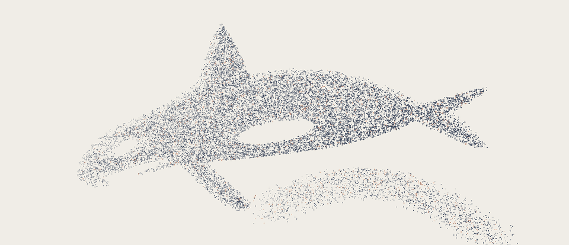

<h1>Lukas Chudy</h1>

<a href="https://lukaschudy.github.io/lukaschudy/orca/" title="Open the interactive particle orca">
  <picture>
    <source media="(prefers-color-scheme: dark)" srcset="./assets/orca-particles-dark.gif">
    <source media="(prefers-color-scheme: light)" srcset="./assets/orca-particles.gif">
    
  </picture>
</a>

I used to play League of Legends professionally. Now I'm building a real-time data layer for fragmented sectors that are still too slow to adapt to AI.

I'm based in London and studying Mathematics &amp; Computation at LSE. I'm also practising competitive programming, trying to take my Codeforces rating from 900 -&gt; 1800 in 9 months.

I track most of what I'm building and learning on <a href="https://www.promethee.io/@lukaschudy">Promethee</a>.

I work mainly with Python, C++, JavaScript/React, PostgreSQL, Docker, AWS, and Cloudflare.

[Nestor](https://heynestor.app) · [Promethee](https://www.promethee.io/@lukaschudy) · [LinkedIn](https://www.linkedin.com/in/lukaschudy) · [X](https://x.com/chudylukass)
