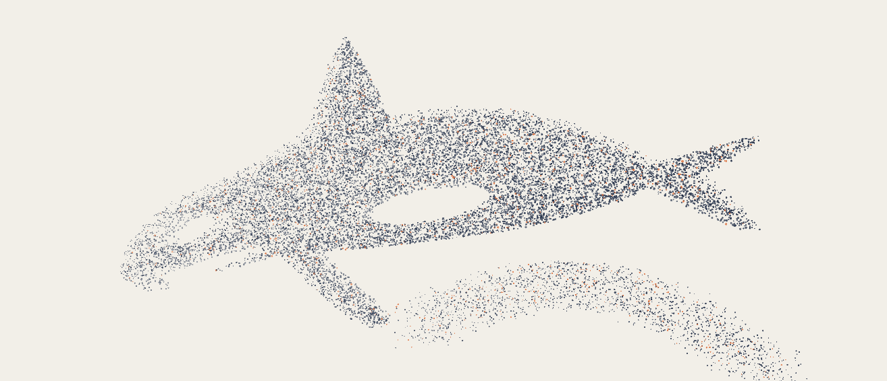

# Lukas Chudy

I used to play League of Legends professionally. Now I'm building a real-time data layer for fragmented sectors that are still too slow to adapt to AI.

  
   
  Move through the particles →

I'm based in London and studying Mathematics & Computation at LSE. I'm also practising competitive programming, trying to take my Codeforces rating from 900 -> 1800 in 9 months.

I track most of what I'm building and learning on [Promethee](https://www.promethee.io/@lukaschudy).

## What I'm building

**[Nestor](https://heynestor.app)** is the first wedge. It starts in the Prague housing market, where listings are fragmented, availability changes quickly, and renters still have to stitch the market together themselves. The system collects, structures, and monitors that data in real time, then uses it to power an AI housing-search agent.

## Selected work

| Project | What it shows |
| --- | --- |
| **[iPhone Action Button TV](https://github.com/lukaschudy/atoms3u-tv-connector)** | Hold the Action Button, say what the TV should do, and release. The open-source stack turns that voice command into authenticated IR or USB HID actions through an M5Stack ATOMS3U, with Windows host software, ESP32 firmware, protocol tests, simulation, and CI builds. |
| **[Robustness of Algorithmic Collusion](https://github.com/lukaschudy/bsc-thesis)** | My bachelor's thesis: reproducible simulations of Q-learning pricing agents under latency, noise, and asynchronous actions, with C++/Fortran simulation code and Python analysis. |
| **[Scrim Data Tracker](https://github.com/lukaschudy/scrim-draft-tracker)** | A scouting and draft-analysis system I built for a professional League of Legends team. It ingests GRID and Riot data and turns large event streams into a coach-facing dashboard. |

## Background

- Mathematics & Computation, London School of Economics
- BSc Economics, minor in Mathematics, University of Groningen
- Former professional League of Legends player
- Based in London

I work mainly with Python, C++, JavaScript/React, PostgreSQL, Docker, AWS, and Cloudflare.

[Nestor](https://heynestor.app) · [Promethee](https://www.promethee.io/@lukaschudy) · [LinkedIn](https://www.linkedin.com/in/lukaschudy) · [X](https://x.com/chudylukass)
